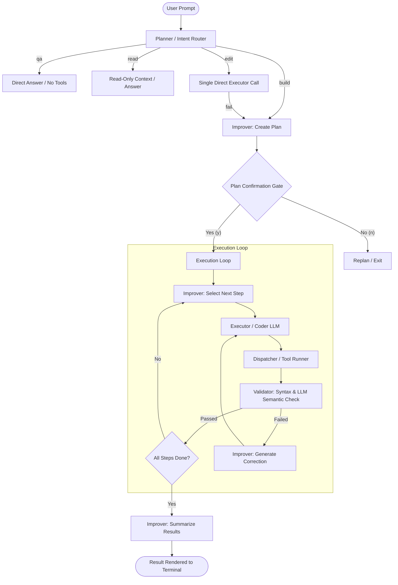

# ⚽ Codi Agent Architecture & Complete Directory Map

This document provides a comprehensive analysis of the multi-agent system structure within the **Codi** codebase. It outlines the roles, responsibilities, logic flows, and directory organization of the agents and support modules that power Codi.

---

## 1. Agent Architecture Overview

Codi operates on a **two-LLM architecture** coordinated by a central **Dispatcher** and validated by a multi-tier **Validator**. Unlike traditional graph-based or state-machine frameworks, Codi uses a clean, system-driven, synchronous execution loop.



---

## 2. Agent Component Directory & Modules

| Component / Subagent | Source File | Key Responsibilities | Primary Operations / Logic |
| :--- | :--- | :--- | :--- |
| **CodiAgent (Core)** | [agent.py](file:///c:/Users/abhey/Desktop/New%20folder/CODI/agent.py) | High-level execution manager and gatekeeper of the loop state. | Sets up execution workspace; runs intent checks; loops until task is completed or reaches `max_iterations`. |
| **Planner (Router)** | [planner.py](file:///c:/Users/abhey/Desktop/New%20folder/CODI/core/planner.py) | Classifies incoming requests to determine the execution mode. | Routes to `qa`, `read`, `edit`, or `build` using fuzzy matching, trigger keywords, and length/file-extension heuristics. |
| **Improver (Orchestrator)** | [improver.py](file:///c:/Users/abhey/Desktop/New%20folder/CODI/core/improver.py) | Coordinates the task lifecycle, forms plans, select steps, and fixes errors. | Generates task requirements, compiles context, writes `plan.md`, tracks step status, calls repair prompts on failure, and summarizes outcome. |
| **Executor (Coder)** | [executor.py](file:///c:/Users/abhey/Desktop/New%20folder/CODI/core/executor.py) | Translates plan steps into structured JSON actions and writes/edits code. | Receives a single step instruction, reads previous action history, resolves targets, and generates tool parameters or raw code. |
| **Dispatcher (Runner)** | [dispatcher.py](file:///c:/Users/abhey/Desktop/New%20folder/CODI/dispatcher.py) | Acts as the interface between agents and the system tools/MCP servers. | Executes tool calls in parallel, handles prompt normalization, and manages MCP connections using a persistent session manager. |
| **Validator (Checker)** | [validator.py](file:///c:/Users/abhey/Desktop/New%20folder/CODI/core/validator.py) | Ensures changes are correct, clean, and syntactically sound. | Directs deterministic validation gates (AST checks, file checks) before running LLM semantic validations. |

---

## 3. Core Agent Lifecycle & Intents

Codi classifies every user request into one of four routing categories (`core/planner.py`):

1. **`qa` (Direct Answer)**
   - Used for general programming questions (e.g., *"What is a binary tree?"*).
   - Answered directly using the Refiner LLM. No tools are executed.
2. **`read` (Context Read-Only)**
   - Used for code explanation and inspection (e.g., *"How is configuration parsed in config.py?"*).
   - Reads relevant file context, explains it, and guarantees no write tools are called.
3. **`edit` (Targeted Single-File Change)**
   - Used for small, localized updates (e.g., *"Change default iterations to 10 in temp_db.py"*).
   - Bypasses the plan-writing phase. The Executor tries one direct tool call. If the check fails, it cleanly falls back to the full `build` workflow.
4. **`build` (Multi-Step Construction)**
   - Used for scaffolding, feature implementation, and broad refactoring.
   - Triggers the complete plan execution workflow (detailed below).

---

## 4. The Execution & Validation Loop

When the agent enters the `build` intent loop, it follows a structured cycle:

### Phase A: Planning and Confirmation Gate
1. **Requirements Extraction**: The Improver parses the task to build a structured set of lists: `must_have`, `must_not`, target `files`, and chosen `framework`.
2. **Context Compilation**: The codebase is queried via ChromaDB and symbol indexers.
3. **Execution Plan Generation**: The Improver writes a plan (up to 5 steps) to [plan.md](file:///c:/Users/abhey/Desktop/New%20folder/plan.md).
4. **Gatekeeping**: Codi pauses execution and waits for the user to type `y`. Giving a different text command prompts Codi to automatically refine and write a new plan.

### Phase B: Step Execution Loop
For each step in the approved plan (max 8 iterations total):
1. **Instruction Delegation**: The Improver evaluates what step should run next and passes it to the Executor.
2. **Surgical Action Choice**: The Executor dynamically chooses a file modification strategy:
   - **Text-Match Replace**: Replaces an exact block of code using multi-level whitespace normalization to accommodate model formatting variations.
   - **Line-Range Surgical Edit**: Requests line-numbered content first, then edits precise lines (`replace_lines`, `delete_lines`, `insert_at_line`).
   - **Content-First**: Overwrites or creates complete files (used for new files or complicated HTML/CSS files).
   - **Additive Append**: Appends new code at the end of the file as a safe fallback when targeted matching fails.
3. **Dispatch**: The Dispatcher coordinates the running tool and records JSON outputs.
4. **Validation Pipeline**:
   - **Deterministic Check**: Checks compile errors, file existence, and framework locks (e.g., ensuring React files aren't contaminated with Vue code via AST validations in `core/validation_utils.py`).
   - **Semantic Check**: If deterministic gates pass, the Validator LLM performs a semantic logic check against requirements.
   - **Self-Correction**: If validation fails, the Validator provides a detailed failure explanation and surgical repair instruction. The Improver digests this, adjusts context, and retries.

---

## 5. Tool Registry & Integration Points

All executable capabilities are configured as standard Python callables inside the `tools/` folder:

* **File System Operations**: (`tools/local/file_tools.py`)
  * `read_file`: Read raw file.
  * `read_file_numbered`: Read file with lines prepended for surgical line edits.
  * `write_file`: Overwrite file contents.
  * `edit_file`: Execute replace/delete/insert operations.
* **Shell Command Execution**: (`tools/local/shell_tools.py`)
  * `run_command`: Standard terminal operations (e.g., `git status`) with a 60-second timeout.
  * `run_command_external`: Spawns a dedicated system terminal window (PowerShell, Terminal.app) for long-running jobs (e.g., `npm run dev`) and pipes live logs. Requires user confirmation before starting.
* **Semantic Code Indexing**: (`tools/local/code_index_tools.py`, `indexer.py`)
  * Uses SQLite and ChromaDB to record symbols, imports, and cross-file call hierarchies, allowing the agent to perform broad impact analysis before refactoring.
* **Model Context Protocol (MCP)**: (`tools/mcp/`, `mcp_manager.py`)
  * Connects third-party tools (Playwright browser navigation, Brave Search, Memory graph database, and GitHub integrations) via a persistent lifecycle connection, ensuring sessions remain active across successive agent steps.

---

## 6. Complete Directory Layout

Here is the directory map outlining where the agent files are located:

```
CODI/
├── agent.py                      # Orchestrator of the agent loop (QA/Read/Edit/Build lifecycle)
├── dispatcher.py                 # Tool executor & router; runs local python tools & MCP instances
├── main.py                       # CLI loop, prompt UI, live status panel renderer
├── cli.py                        # Codi launcher script
├── config.py                     # LLM models, fallback settings, and active provider configuration
├── config_loader.py              # Environment variable and API key resolution (.env)
├── context_trimmer.py            # Manages context window budgets and truncates tool reports
├── indexer.py                    # Generates SQLite and ChromaDB vector codebase indexes
├── llm_factory.py                # Maps and configures backend providers (Ollama, Gemini, Groq, etc.)
├── logger.py                     # Logs JSON execution traces directly to codi.log
├── log_viewer.py                 # Telemetry GUI dashboard launcher (/logs)
├── mcp_client.py                 # Underlying client for Model Context Protocol streams
├── mcp_manager.py                # Persistent MCP server process coordinator
├── memory.py                     # In-memory history compressor
├── status_stream.py              # Status broadcaster for rendering live CLI panels
├── quantized_embeddings.py       # Compress index embeddings for fast retrieval
│
├── core/                         # Core subagents and processing helpers
│   ├── planner.py                # Intent Classifier (qa/read/edit/build routing)
│   ├── improver.py               # Improver subagent (Planner, workflow monitor, correction engine)
│   ├── executor.py               # Coder subagent (Converts steps to JSON tool actions, executes edits)
│   ├── validator.py              # Code verification subagent (AST validation + semantic validation)
│   ├── prompts.py                # Central storage for all LLM system prompts
│   ├── mission_analyzer.py       # Decoders target requirements and deliverables
│   ├── context_builder.py        # Gathers relevant files, tags, and symbols for model context
│   ├── execution_reflector.py    # Reflects on tool errors to propose repairs
│   ├── quick_actions.py          # Bypasses loop for simple file creations
│   └── validation_utils.py       # Framework-lock AST analysis (e.g., checks framework contamination)
│
└── tools/                        # Python functions callable by the agent
    ├── registry.py               # Map of tool names to Python callables
    ├── local/                    # Native filesystem, shell, and index tools
    │   ├── file_tools.py         # Surgical line edits & raw file writes
    │   ├── shell_tools.py        # Process execution (internal & external)
    │   ├── search_tools.py       # Chroma DB search wrapper
    │   ├── code_index_tools.py   # Retrieve symbols and trace code reference graphs
    │   └── project_inspector.py  # Inspect folder tree structure
    └── mcp/                      # Model Context Protocol bridges
        └── mcp_tools.py          # Standardizes MCP calls as standard async tools
```
